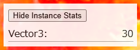

# three-instance-stats

Simple Proxy around Three.js classes to allow a count of how many instances of that class have been created. This only works with classes from Three.js and not everything is supported. Simple classes like Color, Euler and Vector3 are best to test.



This is only for testing Three.js variables introduced into components, not variables instantiated outside of a component, like variable instantiated by react-three/fiber.

Make sure this is not imported into any production builds and only used for dev testing.

## Usage step 1
Comment out variables which you would like to get an instance count of, import then from three-instance-stats instead. If using TypeScript, you will need to import some classes from Three.js for their types. Include InstanceStats for a React component that will display stats as a table.

```js
import {
//     Color,
//     Vector2,
    Vector3 as Vector3Type,
//     Quaternion,
    TextureLoader
} from 'three'

import {
    Color,
    Vector2,
    Vector3,
    Quaternion,
    InstanceStats // React component that displays stats
} from '../path-in-project/three-instance-stats'
```

## Usage step 2
Added InstanceStats component into your app / component.

```js
// Will increment the instance count for Vector3 by 1.
const startingPosition = new Vector3(0.5, 1.0, 2.0);

const ComponentWithStats = () => {
    return (
        <>
            <InstanceStats 
                // Number of miliseconds between each update.
                // Default is 500
                updateTimeMS={1000} 
                // Array of strings selecting which stats to display.
                // If empty display all stats with instance counts > 0
                stats={['Color', 'Euler', 'Vector2', 'Vector3']}
                // Boolean to display all stats regardless of stats value
                showAll={false}
            />
            <Canvas>
                <InstanceScene startingPosition={startingPosition}/>
            </Canvas>
        </>
    )
};
```
